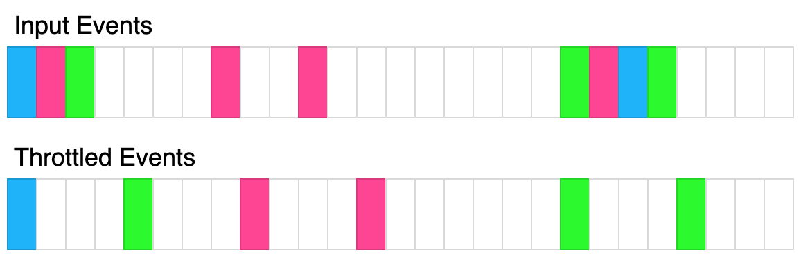

现给定一个函数 fn 和一个以毫秒为单位的时间 t ，请你返回该函数的 节流 版本。

节流 函数首先立即被调用，然后在 t 毫秒的时间间隔内不能再次执行，但应该存储最新的函数参数，以便在延迟结束后使用这些参数调用 fn 。

例如，t = 50ms ，并且函数在 30ms 、 40ms 和 60ms 时被调用。第一次函数调用会在接下来的 t 毫秒内阻止调用函数。第二次函数调用会保存参数，而第三次调用的参数应该覆盖当前保存的第二次调用的参数，因为第二次和第三次调用发生在 80ms 之前。一旦延迟时间过去，节流函数应该使用延迟期间提供的最新参数进行调用，并且还应创建另一个延迟期间，时长为 80ms + t 。

上面的图示展示了节流如何转换事件。每个矩形代表100毫秒，节流时间为400毫秒。每种颜色代表不同的输入集合。
```javascript
/**
 * @param {Function} fn
 * @param {number} t
 * @return {Function}
 */
var throttle = function (fn, t) {
    let last = null;
    let timer = null;
    return function (...args) {
        const cur = Date.now();
        if (last === null || cur - last >= t) {
            fn(...args);
            last = Date.now();
        } else {
            const wait = last + t - cur;
            timer && clearTimeout(timer);
            timer = setTimeout(() => {
                fn(...args);
                last = Date.now();
            }, wait);
        }
    };
};

// 50
// [{"t":50,"inputs":[1]},{"t":75,"inputs":[2]}]

// 70
// [{"t":50,"inputs":[1]},{"t":75,"inputs":[2]},{"t":90,"inputs":[8]},{"t": 140, "inputs":[5,7]},{"t": 300, "inputs": [9,4]}]

/**
 * const throttled = throttle(console.log, 100);
 * throttled("log"); // logged immediately.
 * throttled("log"); // logged at t=100ms.
 */
 ```
