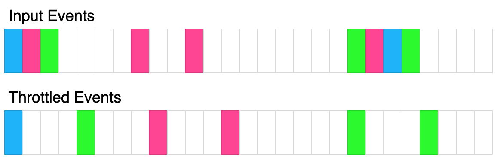

Batching multiple small queries into a single large query can be a useful optimization. Write a class QueryBatcher that implements this functionality.

The constructor should accept two parameters:

An asyncronous function queryMultiple which accepts an array of string keys input. It will resolve with an array of values that is the same length as the input array. Each index corresponds to the value associated with input[i]. You can assume the promise will never reject.
A throttle time in milliseconds t.
The class has a single method.

async getValue(key). Accepts a single string key and resolves with a single string value. The keys passed to this function should eventually get passed to the queryMultiple function. queryMultiple should never be called consecutively within t milliseconds. The first time getValue is called, queryMultiple should immediately be called with that single key. If after t milliseconds, getValue had been called again, all the passed keys should be passed to queryMultiple and ultimately returned. You can assume every key passed to this method is unique.
The following diagram illustrates how the throttling algorithm works. Each rectangle represents 100ms. The throttle time is 400ms.


```javascript
/**
 * @param {Function} queryMultiple
 * @param {number} t
 */
var QueryBatcher = function (queryMultiple, t) {
    this.queryMultiple = queryMultiple;
    this.t = t;
    this.last = null;
    this.str = [];
    this.map = new Map();
};

/**
 * @param {string} key
 * @returns {Promise<string>}
 */
QueryBatcher.prototype.getValue = async function (key) {
    const cur = Date.now();
    if (this.last === null || cur - this.last >= this.t) {
        this.last = Date.now();
        return this.queryMultiple([key]).then((ret) => {
            return ret[0];
        });
    }
    this.str.push(key);
    if (!this.map.has(this.last)) {
        const p = new Promise((resolve) => {
            setTimeout(() => {
                const params = [];
                while (this.str.length) {
                    params.push(this.str.shift());
                }
                this.last = Date.now();
                this.queryMultiple(params).then((ret) => {
                    resolve(ret);
                });
            }, this.t + this.last - cur);
        });
        this.map.set(this.last, p);
    }
    const idx = this.str.length - 1;
    return this.map.get(this.last).then((ret) => {
        return ret[idx];
    });
};
```